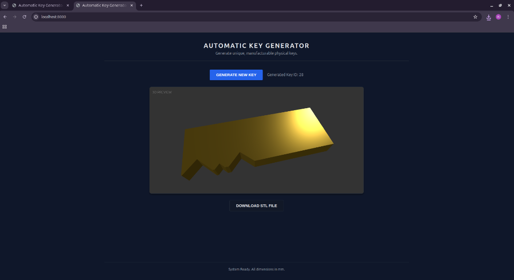
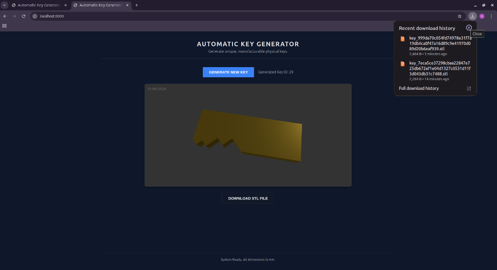

# AutoKey3D - Automatic Physical Key 3D Generation System

A web-based system for generating unique, manufacturable 3D key models (STL) for key shops, ensuring no two keys are identical through SHA256 hashing.

## Folder Structure

The project is organized as follows:

```
AutoKey3D/
├── keygen-project/      # Main Application Source
│   ├── backend/         # FastAPI Server, Logic, Database, & Storage
│   │   ├── main.py      # Entry Point
│   │   ├── generator.py # Key Generation Logic
│   │   ├── geometry.py  # CadQuery 3D Modeling
│   │   └── storage/     # Generated STL Files
│   ├── frontend/        # Static Web Assets
│   │   ├── index.html
│   │   ├── style.css
│   │   └── app.js
│   └── assets/          # Project Images & Screenshots
├── pylibs/              # Local Python Dependencies
└── README.md            # Project Documentation
```

## Features

- **Automatic Generation**: Creates new key designs with unique cut patterns.
- **Uniqueness Guarantee**: Uses SHA256 hashing to ensure global uniqueness.
- **3D Preview**: Interactive WebGL preview of the generated key.
- **Parametric Modeling**: Generates watertight, CNC-ready STL files using CadQuery.

## Screenshots

### 1. Main Interface

*The starting screen where users can initiate key generation.*

### 2. Generated Unique Key

*A successfully generated key with a unique cut pattern and visual preview.*

### 3. Download Ready

*The interface allowing the user to download the final STL file.*

## Setup & Running

This project uses local dependencies in `pylibs` to ensure portability.

1.  **Navigate to the Project Root**:
    ```bash
    cd AutoKey3D
    ```

2.  **Run the Application**:
    Execute the backend module from the `keygen-project` directory context:
    ```bash
    cd keygen-project
    python3 -m backend.main
    ```

3.  **Access the Interface**:
    Open your browser and navigate to:
    [http://localhost:8000](http://localhost:8000)

4.  **Usage**:
    - Click **GENERATE NEW KEY** to create a design.
    - Inspect the 3D model in the preview window.
    - Click **DOWNLOAD STL FILE** to save the model.

